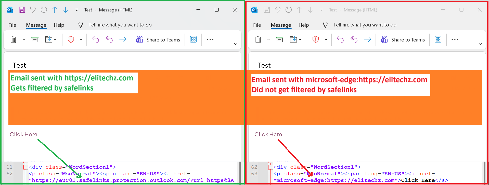
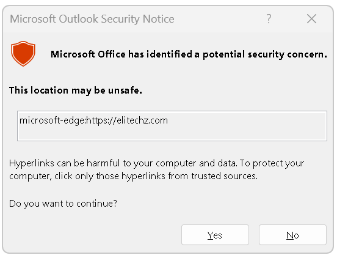

# Safe Links gap using `microsoft-edge:`

**Discovered by:** Paulus1337  
**MSRC submission:** VULN-171095  
**MSRC case:** 106183  
**Security impact:** Security Feature Bypass  
**Status:** Complete and disclosure allowed by MSRC  
**Disclosed on:** 17 April 2026

## Short version

I found a Safe Links gap using the `microsoft-edge:` URI.

This started when I was looking at Microsoft's [https://www.microsoft.com/en-us/edge/features/edge-search-bar](https://www.microsoft.com/en-us/edge/features/edge-search-bar).

While looking at it in DevTools, I saw it trigger this:

```text
microsoft-edge://?ux=searchbar
```

That caught my eye because Safe Links says it supports only **HTTP, HTTPS and FTP** link formats.

So I asked a simple question:

> If I wrap a normal website inside `microsoft-edge:`, will Safe Links still rewrite and protect users?

In my testing, the answer was no for mail flow rewriting. The message passed through, the link was not rewritten the normal Safe Links way, and Classic Outlook for Windows still made it clickable.

## How I found it

I was just clicking around one morning and landed on the [https://www.microsoft.com/en-us/edge/features/edge-search-bar](https://www.microsoft.com/en-us/edge/features/edge-search-bar). I noticed the browser was launching a `microsoft-edge:` URI.

In DevTools I saw this:

```text
microsoft-edge://?ux=searchbar
```

That made me curious, so I checked how Windows handled it.

At the time, this registry location pointed the URI to Edge:

```reg
HKEY_CLASSES_ROOT\microsoft-edge\shell\open\command
```

And the command was:

```reg
"C:\Program Files (x86)\Microsoft\Edge\Application\msedge.exe" "%1"
```

So Windows was passing the full clicked URI straight into Edge.

That was the moment where the Safe Links idea clicked for me. From experience, I already knew Safe Links did not support this URI format.

Microsoft says that in the Safe Links docs here:

- [https://learn.microsoft.com/en-us/defender-office-365/safe-links-about](https://learn.microsoft.com/en-us/defender-office-365/safe-links-about)

If Safe Links only supports **HTTP, HTTPS and FTP**, what happens if the real website is hidden behind `microsoft-edge:` instead?

## What I tested

I tested whether a normal website wrapped in `microsoft-edge:` would still be rewritten by Safe Links in email.

What I saw:

- A normal HTTPS link was rewritten in the usual Safe Links format.
- The `microsoft-edge:` version was not rewritten.
- Sending the URI through email did not trigger spam filters in my testing, even with strong spam filtering policies.
- The message was delivered.
- Outlook on the web and New Outlook were stricter in my testing and did not give me the same easy click path.
- Classic Outlook for Windows still showed the link as clickable.
- Clicking it handed the URI to Windows, which then opened Edge with it.

Test command:
```cmd
start microsoft-edge:https://elitechz.com
```



One side note: Classic Outlook for Windows does show a generic security warning for unknown URIs before opening the link.



## Impact

The real impact I saw was this combination:

- Windows
- Microsoft Edge
- Classic Outlook for Windows

That was the setup where I saw a working click path to the wrapped website.

I only tested these mail clients:

- Outlook on the web
- New Outlook for Windows
- Classic Outlook for Windows

So other email clients might also be affected, but I did not test outside those.

## Why it matters

To me, this is a security coverage gap.

The bigger problem is that this changed how Safe Links treated the link in the first place.

In my original testing, wrapping the destination inside `microsoft-edge:` let the link bypass the normal Safe Links rewrite path and still reach the user's inbox in that wrapped format.

That means links defenders would normally expect Safe Links to inspect, rewrite and make more obvious to users could arrive differently when hidden behind this URI.

This unusual URI also passed strict Office 365 spam filters.

The practical protection ended up depending a lot on the email client. Newer Outlook clients cleaned it up better. Classic Outlook for Windows did not.

The interesting part is that wrapping a website in a different URI changed how mail protections and client behavior lined up.

## Since the report I noticed the following changes in Windows and Office 365 spam filter

After my original discovery, I noticed a small change in the normal `microsoft-edge` handler too.

The registry location stayed the same:
```reg
HKEY_CLASSES_ROOT\microsoft-edge\shell\open\command
```

But later I saw this command line instead:
```reg
"C:\Program Files (x86)\Microsoft\Edge\Application\msedge.exe" --single-argument %1
```

After testing again, I found that past emails with `microsoft-edge:https://<website>` are still clickable in Classic Outlook for Windows.

But new emails now go through the Office 365 spam filter and get sanitized like this before they are sent to the person's inbox:
```text
microsoft-edge:https://<website> -> https://<website> -> https://<loc>.safelinks.protection.outlook.com/...
```

That seems to be the biggest change in this report so far.

I think there is more here. Passing arguments into a client through a URI is interesting by itself, and I would not be surprised if there are more creative edge cases hiding in similar handlers.

It is also cool to just be able to say: **Microsoft patched my discovery :)**

## Another one I noticed

I also noticed `HKEY_CLASSES_ROOT\microsoft-edge-holographic` behaved in exactly the same way.

The registry text I have now for that key only shows the top-level key with `URL Protocol` and does not show an active open command anymore:
```reg
[HKEY_CLASSES_ROOT\microsoft-edge-holographic]
"URL Protocol"=""
```
So that one looks different since my report.

## Vendor coordination

I reported this to MSRC and shared evidence and a benign proof of concept.

Tracked as:
- **Submission:** VULN-171095
- **MSRC Case:** 106183

MSRC later confirmed I was allowed to disclose it publicly.

## Timeline
- **18 January 2026** - Report submitted to MSRC (**VULN-171095**)
- **20 January 2026** - MSRC opened **Case 106183**
- **10 February 2026** - MSRC confirmed engineering investigation was in progress
- **17 April 2026** - MSRC confirmed I was cleared for public disclosure

## References
- [Microsoft Edge Search Bar feature page](https://www.microsoft.com/en-us/edge/features/edge-search-bar)
- [Microsoft Learn - Safe Links in Microsoft Defender for Office 365](https://learn.microsoft.com/en-us/defender-office-365/safe-links-about)
